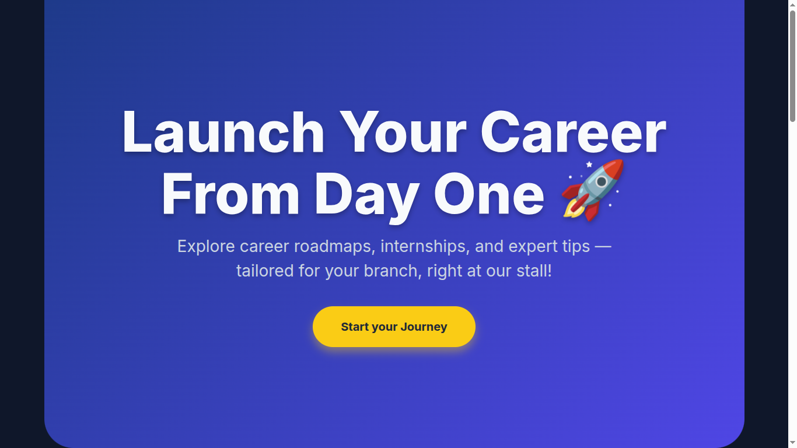
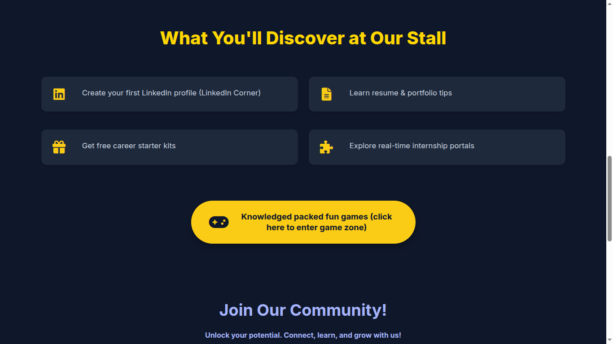
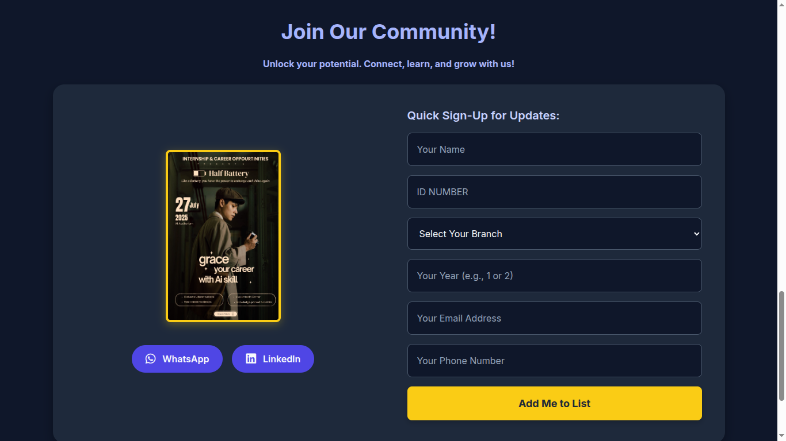

# 🚀 Internships & Career Opportunities Club Portal
**The Official Digital Hub for the Udaan Event Stall**

*“Launch Your Career From Day One”*

---

## 🌟 1. Introduction

Welcome to the digital extension of the **Internships & Career Opportunities Club** stall. This portal is designed specifically for the Udaan event to bridge the gap between physical engagement and digital learning. 

While our physical stall provides face-to-face mentorship, this portal acts as a 24/7 centralized hub. It empowers students to instantly access career roadmaps, discover engaging stall activities, and connect with our community. By linking our on-ground presence with this interactive website, we ensure that the inspiration sparked at the event translates into tangible, long-term career momentum.

---

## 🎯 2. About Udaan Event

Udaan is a premier campus event focused on student innovation and professional growth, held at the Auditorium on 27 July 2025. Our club's participation is deeply rooted in a narrative of rejuvenation and upskilling.

> **Our Event Motto:** *"Like a Battery, you have the power to recharge and shine again."*

* **Theme Inspiration:** Built around the visual concept of a **"Half Battery,"** we recognize the academic fatigue students face. Our stall acts as a charging station, urging students to *"grace your career with Ai skill"*.
* **Vision:** To cultivate a proactive campus culture where students do not just wait for opportunities, but actively build the skills to attract them.
* **Mission:** To demystify the transition from academia to the corporate world by providing accessible resources and actionable guidance.
* **Target Audience:** Driven students from all core engineering branches—CSE, ECE, EEE, Civil, and Mechanical.
* **Expected Impact:** To leave hundreds of attendees recharged, equipped with their first professional profiles, and armed with a clear roadmap for their specific industry.

---

## 🏛 3. Club Stall Necessity

A dedicated career club is a crucial intervention in a student's academic journey. Here is the reason for our presence at Udaan:

* **Bridging the Information Gap:** Many students possess the technical talent but lack awareness of real-time internship portals and industry expectations. We bring this vital information directly to them.
* **Strategic Skill-Building:** Through our curated resources, we help students transition from studying for exams to learning for employability.
* **Fostering Community:** Career building is a collaborative effort. Our stall creates a supportive networking environment where peers and mentors can share insights.
* **Immediate Empowerment:** By offering tangible takeaways—like starter kits and live feedback—we reduce career anxiety and replace it with confident, structured action.

---

## 🚀 4. Stall Highlights & Activities

We have designed our stall to be an immersive, interactive experience rather than a traditional lecture. Key highlights include:

* 🧠 **AI Skill Integration:** Specialized guidance on how to weave high-demand Artificial Intelligence skills into your engineering career.
* 🗺️ **Branch-Specific Roadmaps:** Free, curated career roadmaps available for download tailored to CSE, ECE, EEE, Civil, and Mechanical students.
* 💼 **Live LinkedIn Corner:** Hands-on support to help students build, optimize, and launch their professional online presence.
* 📝 **Resume & Portfolio Crafting:** Practical tips to help students document their projects and showcase their true potential to recruiters.
* 🎮 **Knowledge-Packed Game Zone:** A fun, high-energy area featuring:
  * **Logic Games:** *LinkedIn Hunt*, *Story Stack*, and *Guess the Dream Job*.
  * **Fun Games:** *Tongue Twisters*, *Doodle Disaster*, *Quick Digits*, *Rubix Cube*, and *Paper Cups*.
  * **Rewards:** Top performers receive event opportunities, featured tags, linked account help, and exclusive career starter kits.

---

## 💻 5. Portal Experience

This digital portal guarantees that the Udaan experience lives on long after the event concludes. 

* **Seamless Exploration:** Users can browse upcoming activities, read detailed instructions for the Game Zone via interactive overlay menus, and understand the core benefits of the club.
* **Event Enhancement:** The site allows attendees to skip the physical lines by utilizing the "Quick Sign-Up" form directly on their mobile devices (capturing Name, ID, Branch, Year, Email, and Phone).
* **Career Preparation Hub:** Students have permanent access to digital versions of our career roadmaps and guides to real-time internship portals.
* **User-Centric Navigation:** Built with a dark, modern UI, smooth scrolling, and mobile-responsive grid layouts, the portal ensures a frictionless and visually engaging user journey.

---

## 📸 6. Screenshots Section

*(Replace these placeholder links with actual screenshots of your running portal once they are ready)*

<!--  -->

---

## 🌈 7. Future Vision

This portal is just the foundation. Looking beyond Udaan, we plan to evolve this platform into a comprehensive career ecosystem:

* **AI-Driven Student Guidance:** Integrating a chatbot or assessment tool to recommend personalized skill paths based on a student's unique strengths.
* **Interactive Digital Experiences:** Expanding the website to include live leaderboards for club games, virtual hackathons, and online mock-interview schedulers.
* **Broader Outreach:** Hosting a dynamic, continuously updated digital notice board for immediate internship openings and exclusive alumni webinars.
* **Collaboration Opportunities:** Scaling the platform to co-host events with other university clubs, fostering a multidisciplinary approach to career building.
* **Permanent Campus Fixture:** Transitioning from a temporary event portal to the official, year-round digital headquarters for all student professional development at the university.

---

  
<b>Contact Us:</b> internshipncoclub@sgcrguktsklm.org.in | +91 9966800756

  
<i>&copy; 2025 Internship & Career Club. All rights reserved.</i>

